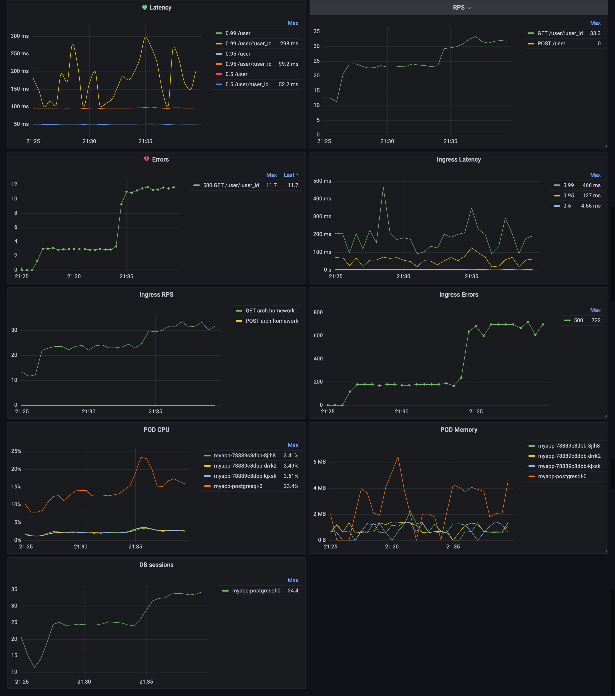

# Otus Homework 03

## Install

```shell
helm install app ./03/helm -n otus-03 --create-namespace
```

## Test

Download [Postman collection](https://raw.githubusercontent.com/wuzyk/otus-microservice-arch/main/03/tools/postman/collection.json)

```shell
newman run ~/Downloads/collection.json
```

## Grafana dashboard

[Download](https://github.com/wuzyk/otus-microservice-arch/blob/main/03/helm/charts/grafana/dashboard.json)



## Uninstall

```shell
helm uninstall app ./03/helm -n otus-03
```
