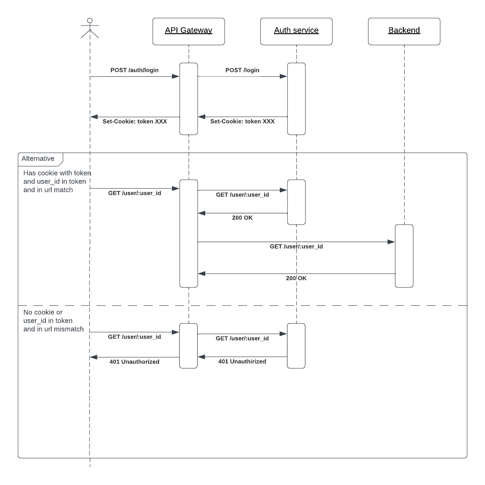

# Otus Homework 05

## Technical solution



## Install

```shell
helm install app ./05/helm -n otus-05 --create-namespace
```

## Test

Download [Postman collection](https://raw.githubusercontent.com/wuzyk/otus-microservice-arch/main/05/tools/postman/collection.json)

```shell
newman run ~/Downloads/collection.json
```

## Uninstall

```shell
helm uninstall app ./05/helm -n otus-05
```
